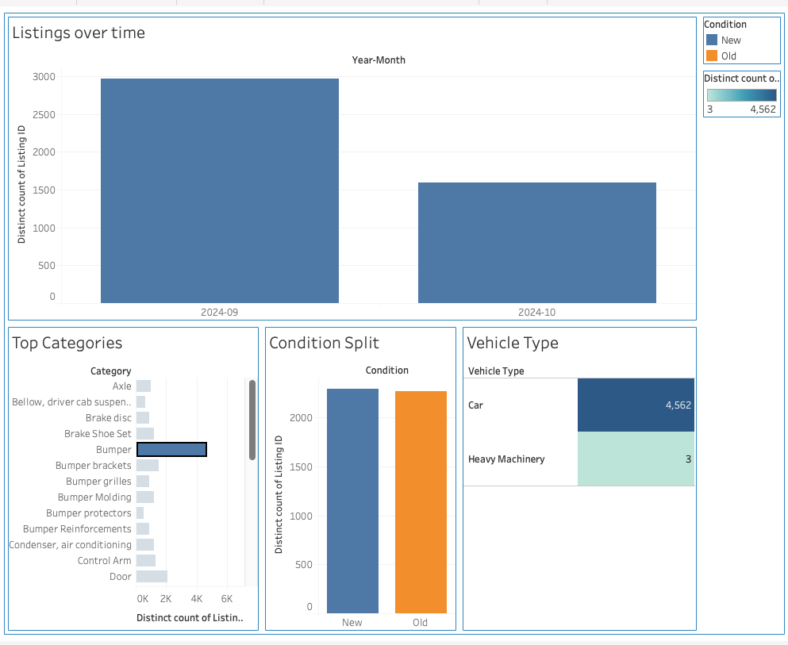
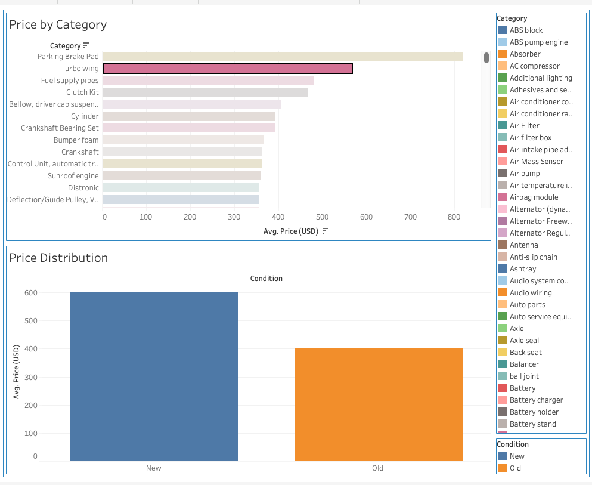
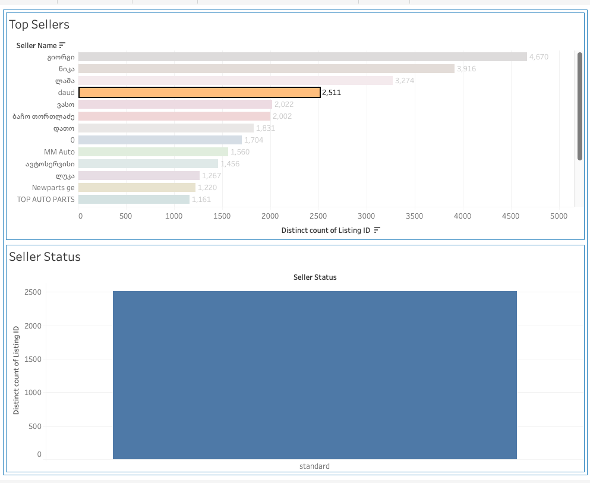

# Auto Parts Tableau Dashboard

A Tableau dashboard analyzing 95,000+ auto parts listings 
from the Georgian marketplace.

## Dashboards
- Overview Dashboard — listings over time, top categories, condition split
- Pricing Dashboard — average price by category
- Sellers Dashboard — top sellers and seller status breakdown

## Preview

## Data Source
Kaggle: Auto Parts Dataset
